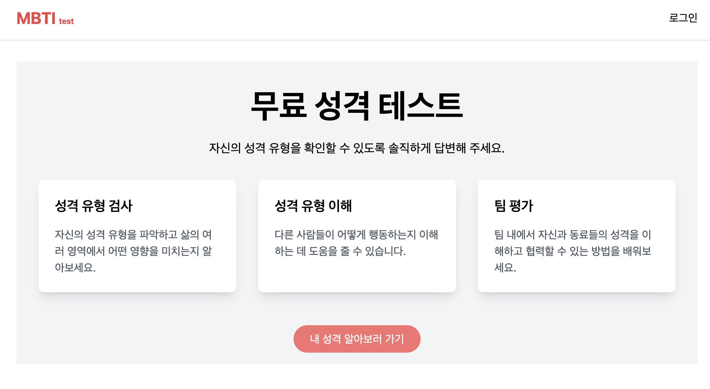

# MBTI Test


- MBTI Test은 사용자가 자신의 MBTI 성격 유형을 간단한 테스트를 통해서 확인할 수 있는 웹 애플리케이션입니다.

[MBTI Test](https://mbti-test-woozi.vercel.app/)

## 주요 기능

- MBTI 테스트 : 사용자가 질문에 답하면 MBTI 유형을 계산하고, 해당 유형에 대한 설명을 제공합니다.

- 회원가입 및 로그인 : 사용자가 아이디, 비밀번호, 닉네임을 이용해 회원가입하고 로그인할 수 있습니다.

- 테스트 결과 관리 : 사용자가 자신의 테스트 결과를 확인, 공개/비공개 전환, 삭제할 수 있습니다.

- 데이터 관리 : 사용자가 회원가입 시 등록한 닉네임을 변경할 수 있고 사용자만의 테스트 결과들을 확인할 수 있습니다.

- 소셜 공유 : 테스트 결과를 카카오톡을 통해  공유할 수 있습니다.

- 반응형 디자인 : Tailwind CSS를 사용하여 다양한 화면 크기에 맞게 최적화된 UI를 제공합니다.

## 사용 기술
- React : UI 라이브러리
- Vite : 빠른 개발 및 빌드 도구
- Tailwind CSS : 유틸리티 기반의 CSS 프레임워크
- React Router : 클라이언트 사이드 라우팅
- Axios : HTTP 클라이언트 라이브러리
- @tanstack/react-query : 데이터 페칭 및 캐싱
- Kakao JavaScript SDK : 카카오톡 공유 기능
- json-server : 개발용 API 서버

## 프로젝트 구조
```
mbti-test-app/
├── src/
│   ├── api/                # API 호출 관련 파일 (auth.js, axios.js testResults.js)
│   ├── assets/             # 이미지, 폰트 등 정적 자원
│   ├── components/         # 재사용 가능한 UI 컴포넌트 (Header, AuthForm, Layout, TestForm, TestResultItem, TestResultList)
│   ├── context/            # 전역 상태 관리 (AuthContext)
│   ├── data/               # 테스트 질문 데이터 (questions.js)
│   ├── hooks/              # Custom Hooks (useTestResults.js)
│   ├── pages/              # 페이지 컴포넌트 (Home, Login, Signup, Profile, TestPage, TestResults )
│   ├── shared/             # 라우터 (ProtectedRoute, Router)
│   ├── utils/              # 유틸리티 함수 (mbtiCalculator.js, shareKakao.js )
│   └── App.jsx             # 메인 애플리케이션 컴포넌트
├── .env                  
├── index.css
├── main.jsx
├── package.json
├── tailwind.config.js
└── vite.config.js
```

## 트러블 슈팅

[useContext사용 시, 새로고침 후 로그인 상태 유지 문제](https://velog.io/@woozi__zi/useContext%EC%82%AC%EC%9A%A9-%EC%8B%9C-%EC%83%88%EB%A1%9C%EA%B3%A0%EC%B9%A8-%ED%9B%84-%EB%A1%9C%EA%B7%B8%EC%9D%B8-%EC%83%81%ED%83%9C-%EC%9C%A0%EC%A7%80-%EB%AC%B8%EC%A0%9C)

[날짜 형식 올바르게 나오게 하기](https://velog.io/@woozi__zi/%EC%8B%9C%EA%B0%84-%ED%98%95%EC%8B%9D%EC%9D%84-%EB%B3%B4%EA%B8%B0-%EC%A2%8B%EA%B2%8C-%EB%B0%94%EA%BE%B8%EB%8A%94-%EB%B2%95)
